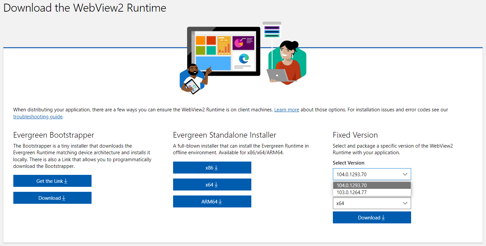

# WebView2 Runtime Archive

[中文文档](README.zh.md)

WebView2 `Fixed Version Runtime` and `NuGet Package` archive

> Official resources
> - [WebView2 Runtime Download](https://developer.microsoft.com/en-us/microsoft-edge/webview2/#download-section)
> - [WebView2 NuGet Package](https://www.nuget.org/packages/Microsoft.Web.WebView2#versions-body-tab)
> - [WebView2 Feedback](https://github.com/MicrosoftEdge/WebView2Feedback/issues)
  
## Why did I create this repository?

Around early 2021, I started following and started using Microsoft's WebView2. Before this, I have been using CefSharp to develop hybrid applications, both are very easy to use, each has its own advantages and disadvantages, I think WebView2 will have more development potential!

In actual development, I prefer to use Fixed Version Runtime, because it is easier to publish software to run on other computers.

After a period of time, I found that on the WebView2 Runtime download page, Fixed Version only provides the latest two versions for download. Therefore, I plan to pay more attention to the updates of WebView2 in the future, and regularly download Fixed Version Runtime and archive it, to use any version in future projects.

After another long time, I found in [WebView2Feedback/issues/2673](https://github.com/MicrosoftEdge/WebView2Feedback/issues/2673) and [WebView2Feedback/discussions/2007](https://github.com/MicrosoftEdge/WebView2Feedback/discussions/2007) someone mentioned this problem, so I created this repository and uploaded my archived files through `Github Releases` (at the same time, I also uploaded the NuGet package of the corresponding version) for everyone to download and use.

## Archive

> The `90` version lacks the arm64 arch archive (because the official website download link was wrong at that time)  
> The `93 ~ 94` versions are not archived (maybe busy with other things during that time, so I forgot to download)

- 104.0.1293.70
- 103.0.1264.77
- 102.0.1245.41
- 101.0.1210.53
- 100.0.1185.44
- 99.0.1150.52
- 98.0.1108.50
- 97.0.1072.62
- 96.0.1054.53
- 95.0.1020.53
- ~~94.0.992.28~~
- ~~93.0.961.33~~
- 92.0.902.73
- 91.0.864.71
- 90.0.818.42 `Missing arm64 arch`
- 89.0.774.77
- 88.0.705.81

## Sponsoring

If you find this project useful you can [buymeacoffee](https://www.buymeacoffee.com/westinyang).

Alternatively, just hit the 'star' here on github.
