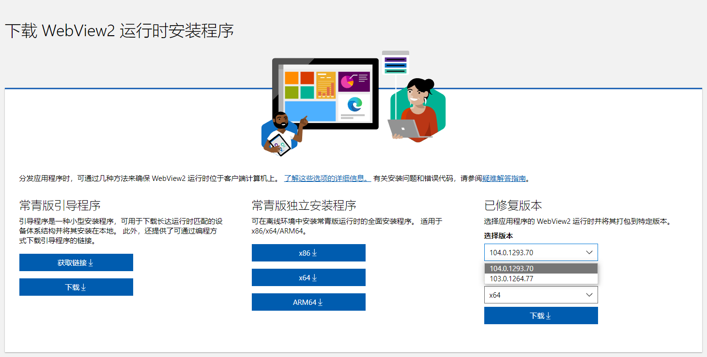

# WebView2 Runtime Archive

[English document](README.md)

WebView2 `Fixed Version Runtime` 和 `NuGet Package` 存档

> 官方资源
> - [WebView2 Docs](https://docs.microsoft.com/zh-cn/microsoft-edge/webview2/)
> - [WebView2 Runtime Download](https://developer.microsoft.com/zh-cn/microsoft-edge/webview2/#download-section)
> - [WebView2 NuGet Package](https://www.nuget.org/packages/Microsoft.Web.WebView2#versions-body-tab)
> - [WebView2 Feedback](https://github.com/MicrosoftEdge/WebView2Feedback/issues)

## 我为什么创建了这个仓库？

2021年年初左右，我开始关注并开始使用微软的 WebView2。在这之前，我一直使用 CefSharp 开发混合应用，两者都很好用，各有优缺点，我认为 WebView2 会更有发展潜力！

在实际开发中，我更倾向于使用 Fixed Version Runtime，因为发布的软件在其他电脑上运行变得更简单。

经过一段时间，我发现在 WebView2 Runtime 下载页面，Fixed Version 只提供最新的两个版本可以下载，所以，我打算接下来经常关注 WebView2 的更新，定期下载 Fixed Version Runtime 并存档，以便在以后的项目中使用任意版本。

又过了很久，我发现在 [WebView2Feedback/issues/2673](https://github.com/MicrosoftEdge/WebView2Feedback/issues/2673) 和 [WebView2Feedback/discussions/2007](https://github.com/MicrosoftEdge/WebView2Feedback/discussions/2007) 中有人提到这个问题，所以我就创建了这个仓库，把我存档的文件通过 `Github Releases` 方式上传（同时，我还上传了对应版本的NuGet包），以供大家下载使用。

## 存档

> `90` 版本缺少arm64架构存档（因为当时官网下载链接有误）  
> `93 ~ 94` 版本没有存档（那段时间可能忙于其他事情所以忘记下载了）

[所有版本](https://github.com/westinyang/WebView2RuntimeArchive/releases)

## 扩展

- 关于如何制作包含固定版本运行时的NuGet包，我并不擅长，不过可以参考这个项目：[ProKn1fe/WebView2.Runtime](https://github.com/ProKn1fe/WebView2.Runtime)

## 交流

- 企鹅群组: 413904300

## 赞助

> 互联网的“记忆”也许是有限的，但我们热爱是无限的！

如果你觉得这个项目有用，你可以 [给我买杯咖啡](https://www.buymeacoffee.com/westinyang)。

或者，只需点击 github 上的 “star” 即可。
